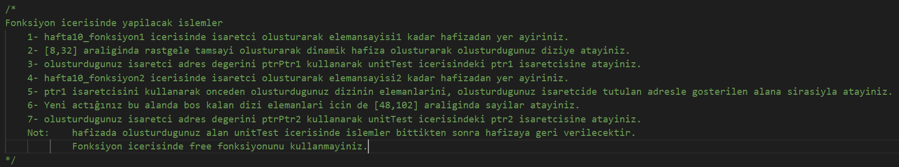

**Github Classroom ile Hafta 10 Lab Uygulaması** 

Uygulama için sizinle paylaşılan link ile oluşturulan Github kod deposu (repository) içerisine sadece sizden istenilen ve aşağıda belirtilen formatta dosyayı yükleyiniz. Yükleyeceğiniz dosya isimlerinde ve yazacağınız  kodda  fonksiyon  isimleri,  giriş  argümanları  ve  çıkış  tipleri  belirtilen  şekilde  olmalıdır. Sistemin yazdığınız kodları notlandırabilmesi için yazdığınız kodun çalışıyor olması gerekmektedir. 

**Yüklenecek dosya adı:** **hafta10.c** 

**Dosya içerisinde tanımlanacak fonksiyonlar:** 

**Yükleyeceğiniz dosya ile ilgili önemli noktalar:**  

- Aksi belirtilmediği takdirde istenilen dosyada ana fonksiyon (*main* fonksiyonu) yazmayınız. (Aksi takdirde sistem derleme işleminde hata oluşur ve puan alamazsınız.) 
- Dosyada fonksiyon tanımları (dosya içerisinde burada prototipi verilen fonksiyonların kodları yer almalıdır.) 
- “*stdio.h*” kütüphanesi ve test için gerekli kütüphaneler *unitTest.c* dosyasında tanımlanmıştır. Kullanacağınız  başka  diğer  kütüphaneler  var  ise  yükleyeceğiniz  dosya  içerisinde  en  başta tanımlayınız. 
- Fonksiyon adı, kullanılan argüman ve geri-dönüş tipi birebir aynı olmalıdır. Kod yazarken fonksiyon  bloğunun  içerisinde  istediğiniz  değişkenleri  istediğiniz  isimde  isimlendirip kullanabilirsiniz. (Hata almamak için Türkçe karakter kullanmamaya özen gösteriniz.) 
- Sizden  yazılmasını  istenilen  algoritmayı  yazınız.  Özellikle  test  dosyasına  göre  sistemi yanıltmak için çıktı üretenler hakkında işlem yapılacak ve cezalandırılacaktır.  
- Yüklediğiniz  kodlar  benzerlik  tarama  sisteminden  geçirilecektir.  Lütfen  kendi  yazdığınız kodları sisteme yükleyiniz. 

**İlgili Hafta Uygulama Depo Yükleme Son Tarihi ve Saati:** 02.05.2023 15:30
 
Kaç puan alacağınızı öğrenmek için:  
 
Sizin  için  oluşturulan  şablon  kod  deposunu  (repository)  bilgisayarınıza  indirerek  ve yüklemeniz  gereken  dosyayı  oluşturup  “unitTest.c”  dosyasını  derlediğinizde  oluşan  not.txt dokümanından  notunuzu  görebilirsiniz.  Aynı  zamanda  yazdığınız  kodların  doğruluğunu  bu  şekilde test edebilir ve notunuzu yükseltmek için kodunuzu güncelleyerek Github Classroom kod deponuza yükleyebilirsiniz.  (Lütfen  sadece  yüklenmesi  istenilen  dosyayı  yükleyiniz.  *unitTest*  vb  gibi  diğer dosyalarda  değişiklik  yapmayınız  ve  yüklemeyiniz.  Aksi  takdirde  oluşturulan  sistem  bunu değerlendirmeyi yanıltma olarak algılayacaktır.) 
 
Uygulama veya Sistem ile ilgili bir hata görürseniz lütfen dersin hocası ile iletişime geçiniz. 
